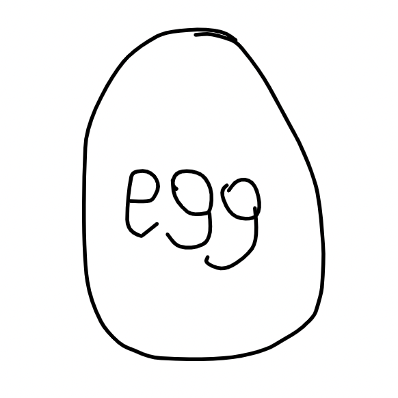

# NFT's dinámicos

- El contrato inteligente actualiza la metadata del NFT en 5 etapas, cambiando principalmente su imagen para representar un renacuajo en crecimiento hasta llegar a sapo adulto. 

## Etapas del NFT: 
1 - 
2 -  
3 -  
4 -  
5 -  

## Deploy:
- Goerli Testnet 
- Dirección del Contrato: 0x0Eb4B06358D49E562A0Cfdca899e89b3Fd796daF
- Time gap 240 segundos entre cada cambio
- Wallet utilizada: 0x84130BFbaeEa90b22921418b2E93Dc279EA85337

## Chainlink Keeper: 

- 

Utilización de Remix.IDE, ChainLink Keeper, testnets.opensea.io, sin front aun. 

## Pedi el tuyo 😜
