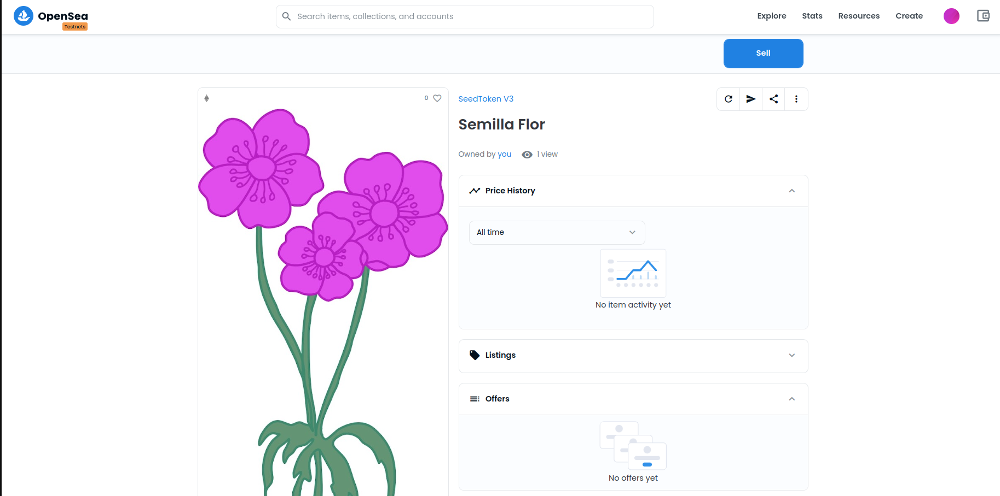
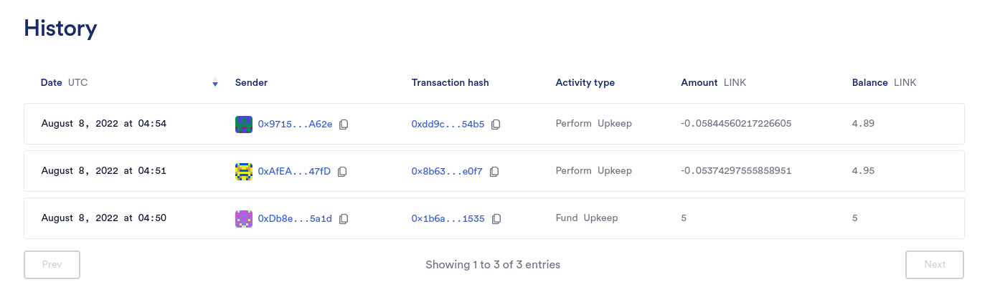
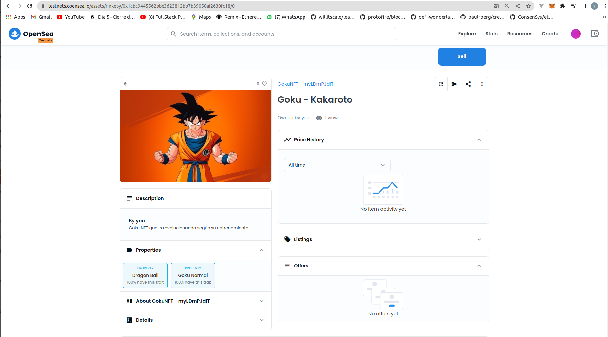
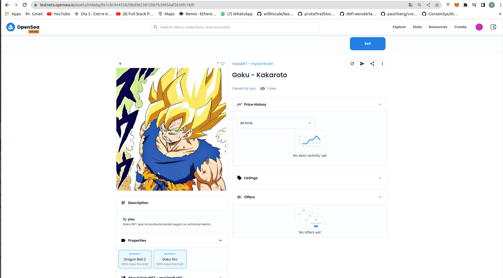
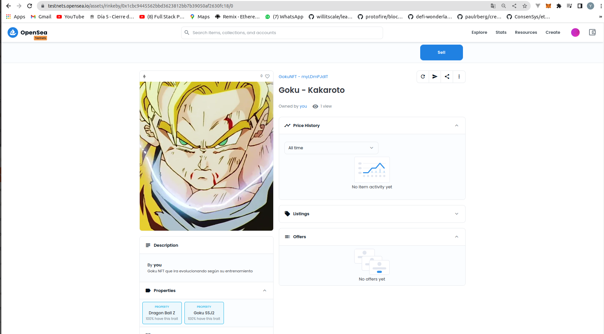
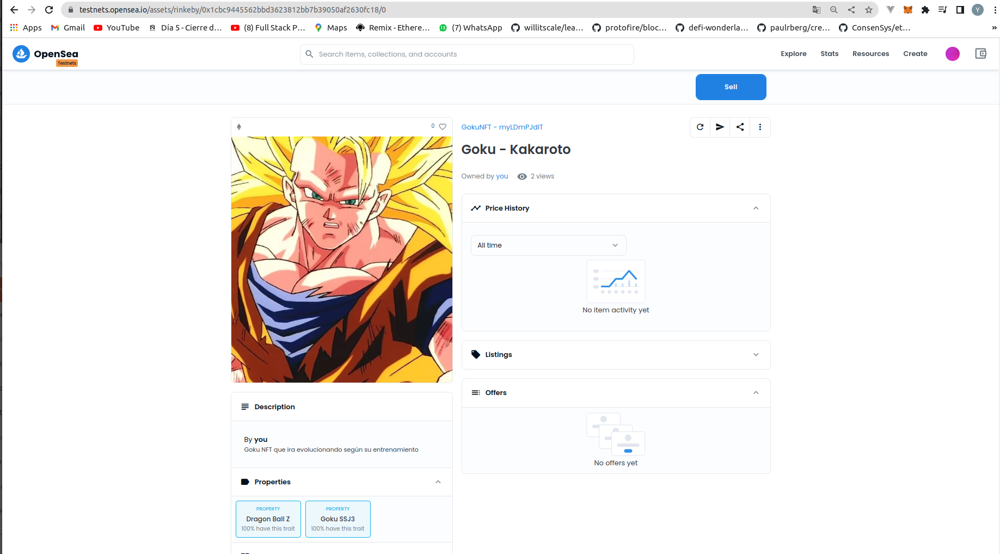
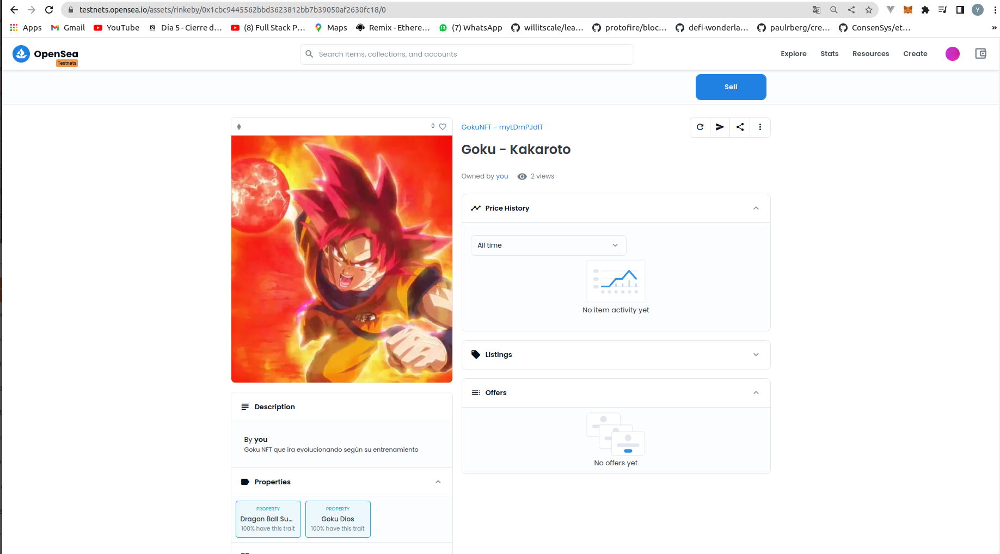
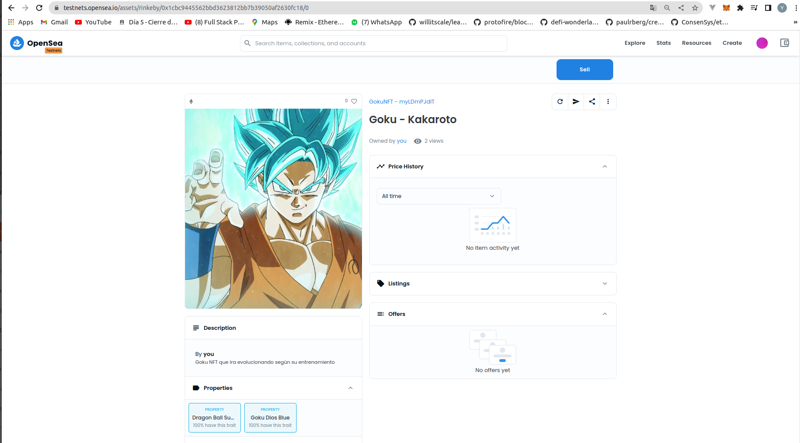
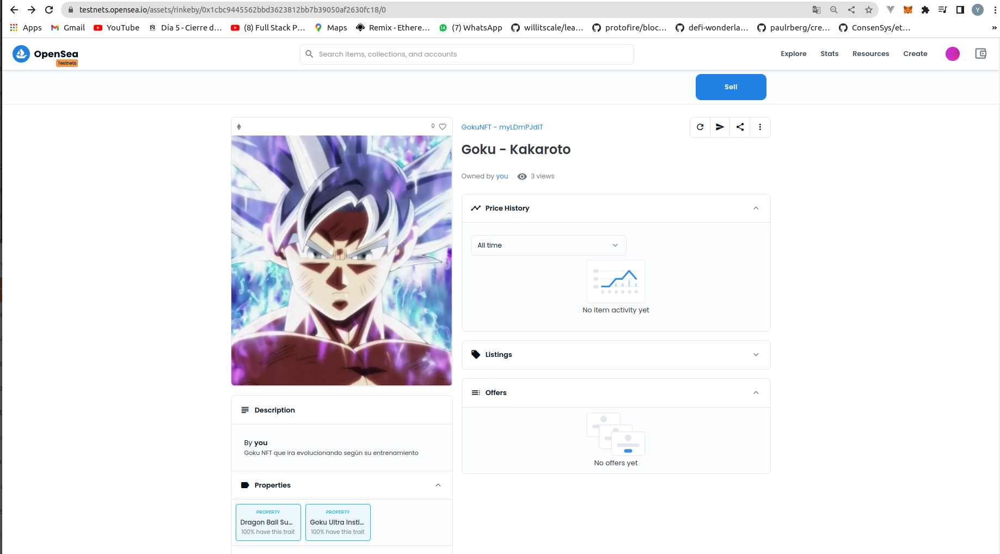
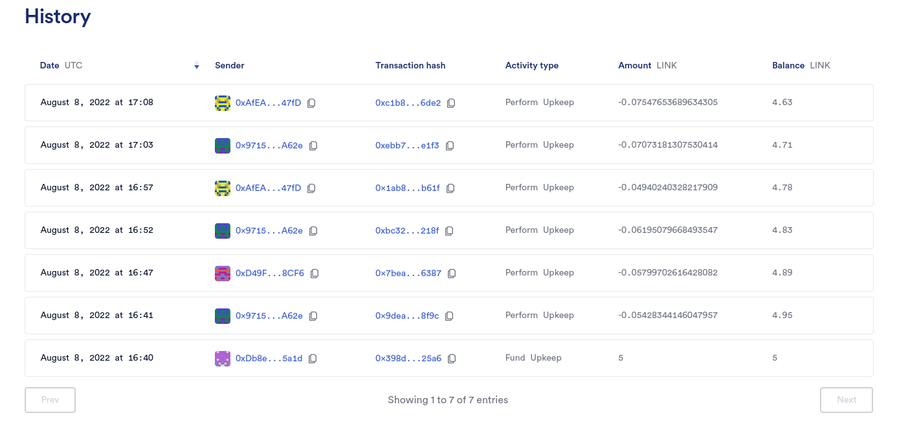

# Aprendamos a crear NFT's dinámicos

## Reto 1

Vamos a aprender a crear NFT's dinámicos, lo que significa que pueden cambiar su metadata dependiendo de ciertas condiciones que definamos. 

Para lograrlo necesitamos conectarnos un herramientas que nos provea la información para automaizar nuestro contrato inteligente, es esta ocasión vamos a usar algunos servicios de chainlink

Los pasos que debes seguir son:

1. Debes subir las imagenes de la metadata que quieres que cambie del NFT a una red IPFS, puede usar [pinata](https://www.pinata.cloud/)
2. En remix debes desplegar el contrato inteligente, para ellos necesitas tokens para la red de prueba rinkeby, que puedes solicitar en este [faucet](https://www.pinata.cloud/)
3. Debemos validar que nuestro contrato inteligente se desplego correctamente en [rinkeby](https://rinkeby.etherscan.io/) y que podamos visualizar nuestro NFT en el ambiente de pruebas de [OpenSea](https://testnets.opensea.io/)
4. Vamos a crear en la pagina de chainlink ese elemento que nos va a permitir automatizar el cambio de la metadata de nuestro NFT, para ello debemos ingresar en la pagina [keeper](https://keepers.chain.link)
5. Seleccionamos la opción "register new upkeep"
6. A continuación seleccionamos "Custom-logic"
7. Debemos ingresar la dirección del contrato inteligente que desplegamos en Remix
8. Ingresamos los siguientes valores Upkeep name, Gas limit: 200000, Starting balance (LINK):5, Your email address
9. Aprobamos la transacción y esperamos que se proceso para la red de chainlink.
10. Ya podemos ver como nuestro NFT va a cambiar metadata dependiendo del tiempo que hayamos establecido al momento de desplegar el contrato y sera el que ejecute el keeper de chainlink.
11. Para validar que efectivamete la metadata de nuestro NFT esta cambiando, podemos usar las funciones de tokenURI que nos permite saber que metada tiene determinado NFT o la función flowerStage que retorna un número entre 0-2 y podriamos ver como va incrementado.
12. Si quiere visualizar como cambia la metadata de tu NFT en opensea tienes que ingresar a la colección que creaste, ingresar en el primer elemento y en la esquina superior derecha selección la opción actualizar metadata, finalmente debes actualizar la ventana para poder ver los cambios.

RETO SOLUCIONADO:

Contrato Modificado: SeedAutomatic.sol

Desplegado en rinkeby: 0x81751c052307Ba3FA6520B423D96d06721D3c044 (https://rinkeby.etherscan.io/address/0x81751c052307Ba3FA6520B423D96d06721D3c044)

Metadata Final en Opensea

Llamadas ChainLink

## Reto 2

1. Modifica el código original del repositorio para permitir que tu NFT tenga 5 cambios de metadata.
2. Realizar el despliegue del contrato módifico 
3. Crear una nueva automatización por tiempo como se ejecuto en el paso 1.

RETO SOLUCIONADO:

Contrato Modificado: GokuDynamicNFT.sol

Desplegado en rinkeby: 0x1CbC9445562bBd3623812bB7b39050aF2630fc18 (https://rinkeby.etherscan.io/address/0x1CbC9445562bBd3623812bB7b39050aF2630fc18)

Se mintio un NFT de goku desde su estado normal y a través de Chainlink de forma automatizada paso por SSJ, SSJ2, SSJ3, Dios, Blue, Ultra Instinct

Goku - Normal:

Goku - SSJ:

Goku - SSJ2:

Goku - SSJ3:

Goku - Dios:

Goku - Dios Blue:

Goku - Ultra instinto:

Llamadas de chain-link:

## Reto 3 (Opcional)

1. Crear una interfaz gráfica con react que permita subir la imagen, el nombre, la descripción,  caracteristicas del NFT y que se encargue de generar el archivo JSON de metadata y lo suba a la red IPFS de su preferencia 
2. Desplegar el contrato inteligente.
3. Realizar las pruebas de funcionamiento

## Recursos

* [Qué es chainlink](https://chainlinkspanishcommunity.medium.com/qu%C3%A9-es-chainlink-6ea80f9ff95e)
* [Documentación de Chainlink ](https://docs.chain.link/docs)

